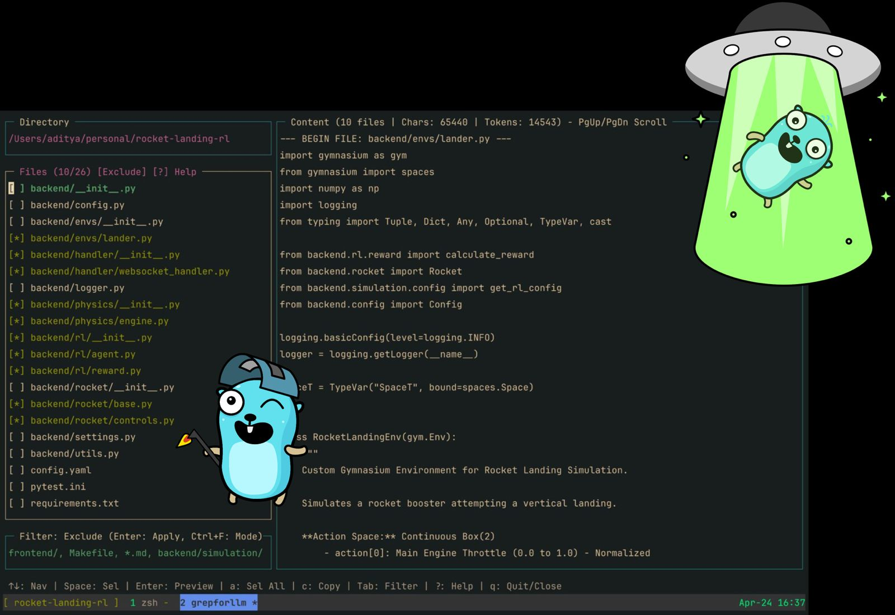

# grepforllm

grepforllm is a cli tool i build & use to filter and select text files from my codebase using a terminal interface. I can apply include/exclude filters, mark files, then concatenates the content of selected files and copies the result to my system clipboard.

```
make run
```


## my personal setup

- i run `grepforllm` inside tmux via a hotkey
- the built binary is located at `~/scripts/grepforllm` on my machine
- in my zsh config, i have an alias set up: `alias grepforllm='~/scripts/grepforllm'`, so i can just type `grepforllm` in any terminal directory to launch it from anywhere

i recemmend same for you (reader) if you are going to use grepforllm



---

my full dotfiles setup is avaliable on [github.com/adimail/dotfiles](https://github.com/adimail/dotfiles)
